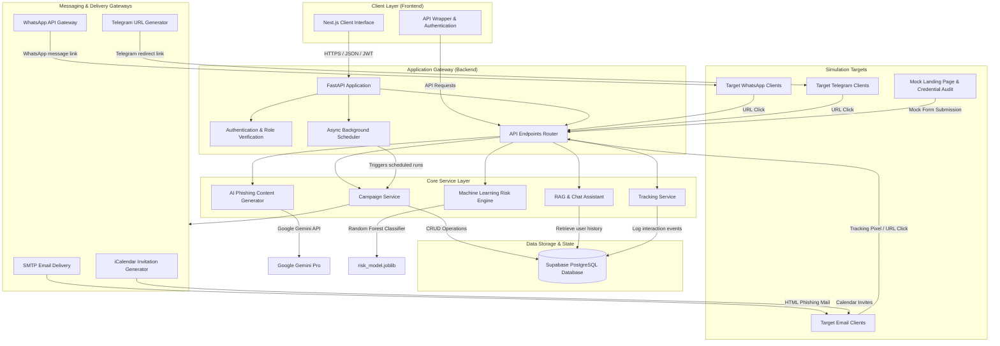
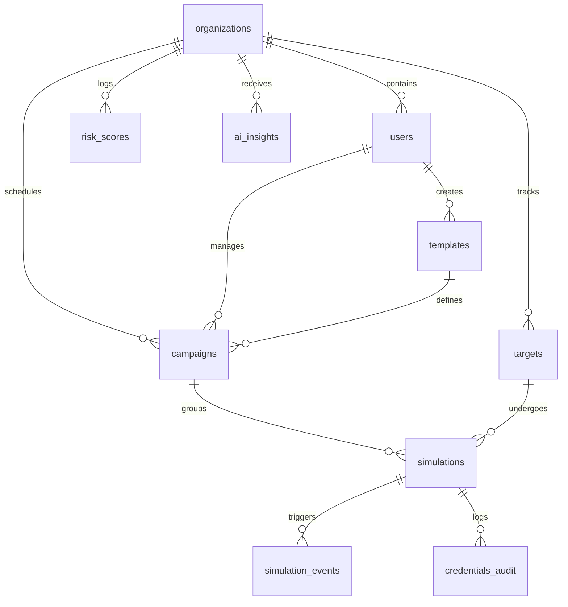

# Phishlytics

Phishlytics is an enterprise security awareness training and phishing simulation platform. It enables organizations to assess, track, and mitigate human risk through realistic social engineering simulations. The platform orchestrates simulated campaigns across multiple channels, captures real-time employee responses, applies machine learning to predict risk indices, and uses generative AI to customize simulated attack content.

---

## Architecture Overview

The system follows a decoupled client-server architecture with a Next.js frontend, a FastAPI backend, and a Supabase database instance. Real-time background processing, automated scheduling, machine learning models, and AI integrations run natively within the backend service layer.

### System Architecture Diagram



### Component Breakdown

#### Frontend Application
The user interface is built using Next.js, implementing the App Router paradigm.
* **Route Structure**: Supports dashboards for administrators, security advisors, and operational coordinators. Includes specialized pages for campaign initialization, target employee directory management, and live analytics visualization.
* **Component Library**: Includes custom interface elements designed using Radix UI primitives and styled with Tailwind CSS for layout rendering.
* **Animations**: Integrates GSAP for smooth micro-animations, dashboard loading states, and responsive transitions.
* **State & Authentication**: Uses browser-stored JSON Web Tokens (JWT) and cookies to persist sessions. It communicates with the backend via a centralized client helper wrapper.

#### Backend Application
The application logic is driven by a FastAPI gateway running on Python.
* **Routing System**: Modular routers segment endpoints by domain, including campaigns, targets, users, authentication, event tracking, analytics, and chatbot communications.
* **Async Scheduler**: A persistent background task runner starts during FastAPI initialization. It polls the database every 30 seconds to fetch scheduled campaigns and dispatches them without blocking main thread API requests.
* **Generative AI Content Generator**: Connects with Google Gemini Pro using the official Python SDK. It generates tailored phishing templates based on specific parameters such as corporate brand names, employee departments, and requested urgency levels.
* **Machine Learning Risk Engine**: Implements a Random Forest Classifier trained on historic simulated events. The model analyzes individual employee interactions (emails opened, links clicked, and credentials submitted) to predict organizational risk levels.
* **Retrieval-Augmented Chatbot (RAG)**: Retrieves individual simulation history from the database to supply context-appropriate cybersecurity advice during interactive chatbot conversations.

---

## Database Schema

The database utilizes PostgreSQL hosted on Supabase. Relationships, foreign keys, and constraints structure the storage layer.



### Database Tables Detail

#### 1. `organizations`
Represents the company tenant configuration in the multi-tenant system.
* `id` (UUID, Primary Key): Unique organization identifier.
* `name` (Text): Legal or operational company name.
* `created_at` (Timestamptz): Timestamp of account initialization.

#### 2. `users`
System administrators, advisors, and operators managing the platform.
* `id` (UUID, Primary Key): User identifier.
* `organization_id` (UUID, Foreign Key): Links to `organizations`.
* `email` (Text, Unique): Login email credentials.
* `name` (Text): Full name of the user.
* `mobile` (Text): Mobile phone number.
* `role` (Text): Allowed roles are either 'admin' or 'user'.
* `created_at` (Timestamptz): Creation timestamp.

#### 3. `targets`
The employees targeted by security awareness training and phishing simulations.
* `id` (UUID, Primary Key): Target identifier.
* `organization_id` (UUID, Foreign Key): Links to `organizations`.
* `email` (Text): Target email address.
* `name` (Text): Name of the employee.
* `department` (Text): Target corporate department (for example, Human Resources, Engineering, or Finance).
* `risk_index` (Float): Current individual vulnerability index.
* `behavioral_tags` (Text Array): Labels assigned based on performance (for example, clicked-links, submitted-credentials).
* `whatsapp_number` (Text): Number for SMS and WhatsApp campaigns.
* `discord_handle` (Text): Target identifier for Discord simulations.
* `created_at` (Timestamptz): Date enrolled in the target database.

#### 4. `templates`
The design layouts and content used for training and phishing drills.
* `id` (UUID, Primary Key): Template identifier.
* `name` (Text): Friendly name of the template.
* `type` (Text): Type of template, constrained to 'phishing', 'credential', or 'training'.
* `subject` (Text): Email subject line.
* `content` (Text): HTML payload or plain text simulation copy.
* `is_ai_generated` (Boolean): Identifies if the content was built by Gemini.
* `ai_prompt_context` (JSONB): The metadata parameters passed to the AI generator.
* `created_by` (UUID, Foreign Key): References the creator in the `users` table.

#### 5. `campaigns`
The scheduled campaign records containing targeting instructions.
* `id` (UUID, Primary Key): Campaign identifier.
* `organization_id` (UUID, Foreign Key): Links to `organizations`.
* `template_id` (UUID, Foreign Key): Links to the chosen template in `templates`.
* `title` (Text): Name of the simulation run.
* `description` (Text): Description and target scenarios.
* `type` (Text): Constrained to 'phishing', 'credential', or 'training'.
* `status` (Text): Allowed states are 'draft', 'scheduled', 'running', 'completed', or 'cancelled'.
* `scheduled_at` (Timestamptz): Future execution time.
* `include_qr_code` (Boolean): Flag to render simulated QR codes in email campaigns.
* `selected_target_ids` (JSONB): Array of target UUIDs to test.
* `ad_hoc_emails` (JSONB): Ad-hoc email addresses added to bypass standard targeting list.
* `created_by` (UUID, Foreign Key): References the managing user.
* `attack_channel` (Text): Primary delivery method, defaulting to 'email_link'.

#### 6. `simulations`
Individualized simulation trackers linking a campaign to a specific target.
* `id` (UUID, Primary Key): Simulation instance identifier.
* `campaign_id` (UUID, Foreign Key): Links to the parent campaign.
* `target_id` (UUID, Foreign Key): Links to the specific target employee.
* `tracking_id` (Text, Unique): Randomly generated UUID used in tracking links, open pixels, and redirect URLs.
* `email_sent` (Boolean): Flag tracking successful email dispatch.
* `sent_at` (Timestamptz): Dispatch timestamp.
* `last_event_at` (Timestamptz): Time of the latest recorded event.
* `channel` (Text): Selected distribution method (for example, email, WhatsApp, or Telegram).

#### 7. `simulation_events`
Individual actions taken by targets during a simulation run.
* `id` (UUID, Primary Key): Event identifier.
* `simulation_id` (UUID, Foreign Key): Links to the specific simulation.
* `event_type` (Text): Tracked events are constrained to 'email_opened', 'link_clicked', 'credential_submitted', 'training_viewed', or 'calendar_accepted'.
* `ip_address` (Text): Client IP address recording the action.
* `user_agent` (Text): Browser user agent header string.
* `metadata` (JSONB): Additional browser attributes or headers.

#### 8. `credentials_audit`
Records details of submitted mock credentials during credential-harvesting simulations without storing cleartext passwords.
* `id` (UUID, Primary Key): Audit entry identifier.
* `simulation_id` (UUID, Foreign Key): Links to the associated simulation.
* `password_strength` (Text): Assessed password strength (for example, weak, medium, strong).
* `length` (Integer): Character count of the submitted password.
* `contains_special_chars` (Boolean): Presence of special characters.

#### 9. `risk_scores`
Aggregate security status logs computed over time.
* `id` (UUID, Primary Key): Log identifier.
* `organization_id` (UUID, Foreign Key): Links to `organizations`.
* `campaign_id` (UUID, Foreign Key): Links to the associated campaign.
* `risk_level` (Text): General classification (low, medium, high).
* `click_rate` (Float): Percentage of targets who clicked the link.
* `credential_rate` (Float): Percentage of targets who submitted credentials.

#### 10. `ai_insights`
Automated performance reviews and mitigation instructions generated based on analytics data.
* `id` (UUID, Primary Key): Insight identifier.
* `organization_id` (UUID, Foreign Key): Links to `organizations`.
* `insight_type` (Text): Classification category.
* `summary` (Text): Narrative breakdown of organizational behavior.
* `recommendation` (Text): Steps to decrease vulnerabilities.

---

## Key Feature Workflows

### 1. Simulated Content Synthesis
When creating campaigns, administrators can request AI-generated content.
1. The administrator chooses a corporate brand and provides contextual details (for example, a mandatory training notification).
2. The `AIService` prepares a structured prompt including target department contexts.
3. Google Gemini Pro receives the prompt and responds with a JSON payload containing the simulated subject and body content.
4. The backend injects localized phishing markers and appends standard tracking placeholders.

### 2. Campaign Orchestration and Delivery
When a campaign begins execution (either instantly or through the background scheduler):
1. The scheduler fetches upcoming campaigns and queries the target table for the chosen targets.
2. For each target, the system generates a unique `tracking_id` UUID and creates a `simulations` table record.
3. Depending on the `attack_channel` parameter, it invokes the appropriate delivery gateway:
   * **SMTP Gateway**: Formulates HTML and dispatches emails containing custom tracking links and hidden 1x1 tracking image pixels.
   * **iCalendar Gateway**: Generates a standard ICS meeting file containing click-tracking hooks and schedules an invite.
   * **WhatsApp Gateway**: Constructs messaging URLs with custom redirects, then dispatches them to mobile numbers.
   * **Telegram Gateway**: Generates Telegram-compatible distribution links.

### 3. Real-Time Action Auditing
When a user interacts with a simulation:
1. **Email Opens**: The email client requests the 1x1 hidden image pixel via `/api/v1/tracking/pixel/{tracking_id}`. The tracking router captures the request header metadata and logs an `email_opened` event.
2. **Link Clicks**: The target clicks the tracking link in the message, routing to `/api/v1/tracking/click/{tracking_id}`. The backend logs a `link_clicked` event and redirects the browser to the mock landing page.
3. **Credential Harvesting**: If the mock landing page prompts the target to sign in, any submitted credentials are intercepted. The length and character strength of the credentials are evaluated and written to `credentials_audit`. A `credential_submitted` event is logged, and the user is redirected to security training.

### 4. Vulnerability Risk Calculations
The system calculates individual and company-wide risk values:
1. Periodically, the backend gathers the total sum of opens, clicks, and submissions for each target employee.
2. The `MLRiskService` parses these counts. If the local Random Forest model has been trained, it runs a predictive classification on the vector. If not trained, it falls back to a weighted baseline calculation:
   $$\text{Risk Score} = (\text{Opens} \times 0.1) + (\text{Clicks} \times 0.4) + (\text{Credential Submissions} \times 0.5)$$
3. The individual risk index is saved, and organizational risk reports are populated.

---

## Getting Started

### Prerequisites
* Python 3.11 or higher
* Node.js 18.0 or higher
* Supabase Account (with API URL, Anon Key, and Service Role Key)
* Google Generative AI API Key (for Gemini Pro access)

### Backend Deployment and Setup
1. Move to the backend folder:
   ```bash
   cd backend
   ```
2. Create and activate a Python virtual environment:
   ```bash
   python -m venv .venv
   .venv\Scripts\activate
   ```
3. Install required libraries:
   ```bash
   python -m pip install --upgrade pip
   python -m pip install -r requirements.txt
   ```
4. Configure database schema:
   Apply the SQL queries in `backend/schema.sql` inside the Supabase SQL editor to set up the necessary tables, relationships, and constraints.
5. Create a `.env` file from the example configuration:
   ```bash
   cp .env.example .env
   ```
6. Update environment variables in `.env`:
   * `SUPABASE_URL`: Your Supabase API endpoint.
   * `SUPABASE_KEY`: Your Supabase anonymous client key.
   * `SUPABASE_SERVICE_KEY`: Your Supabase service role key (required for administrative operations).
   * `GOOGLE_API_KEY`: Your Gemini API access key.
7. Launch the backend application:
   ```bash
   uvicorn app.main:app --host 0.0.0.0 --port 8000 --reload
   ```

### Frontend Deployment and Setup
1. Move to the frontend folder:
   ```bash
   cd ../frontend
   ```
2. Install npm dependencies:
   ```bash
   npm install
   ```
3. Set environment variables by creating a `.env.local` file:
   ```env
   NEXT_PUBLIC_BACKEND_URL=http://localhost:8000
   ```
4. Run the Next.js development server:
   ```bash
   npm run dev
   ```
5. Access the user interface by visiting `http://localhost:3000` in your web browser.
