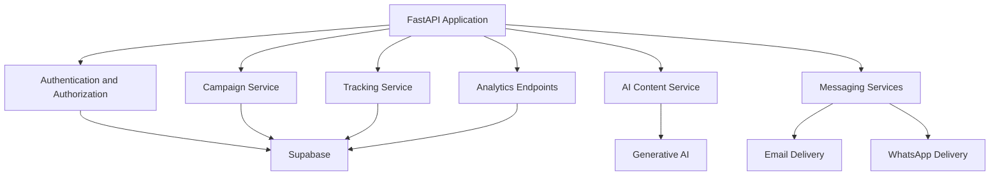

# Backend

This directory contains the FastAPI backend for Breach 2026. It provides authentication, campaign orchestration, delivery services, event tracking, analytics, and AI-assisted simulation content.

## Architecture



## Features

- JWT-based authentication and role enforcement
- Organization-aware campaign creation and dispatch
- Scheduled campaign execution
- Email, calendar invite, and WhatsApp delivery support
- Event logging for opens, clicks, and credential submissions
- Organization and campaign analytics
- AI-generated phishing simulation content

## Prerequisites

- Python 3.11.9
- Access to the Supabase project referenced by the environment variables
- Optional SMTP credentials for real email delivery

## Environment Variables

Define the variables listed in `.env.example` before starting the service.

## Local Development

```bash
python -m pip install -r requirements.txt
uvicorn app.main:app --host 0.0.0.0 --port 8000
```

## Deployment

Render should be configured with the backend root directory, this build command, and the following start command:

```bash
uvicorn app.main:app --host 0.0.0.0 --port $PORT
```

## Notes

- The scheduler should only run when Supabase connectivity is available.
- The application uses the backend templates under `app/templates/` for simulation content.