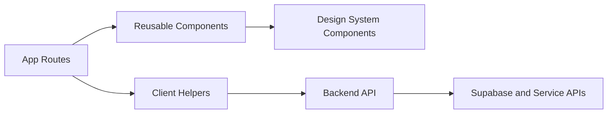

# Frontend

This directory contains the Next.js frontend for Breach 2026. It provides the user interface for authentication, dashboards, campaign management, simulation workflows, and analytics visualization.

## Architecture



## Features

- Landing pages and authentication flows
- Dashboard views for users, advisors, and operations
- Campaign creation and simulation interfaces
- Analytics pages for campaign and organization reporting
- Shared UI primitives and layout components
- Backend integration helpers for authenticated API requests

## Local Development

```bash
npm install
npm run dev
```

Open http://localhost:3000 in your browser after the development server starts.

## Environment Variables

The frontend reads backend connection settings from environment variables such as `NEXT_PUBLIC_BACKEND_URL` and `BACKEND_URL`.

## Deployment Notes

- The frontend is a standalone Next.js application.
- Ensure the backend API URL is configured before building or deploying.
